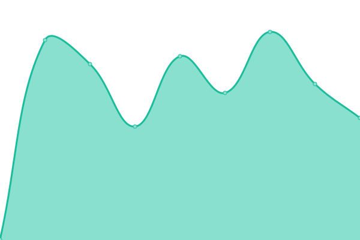

# [📈 Live Status](https://demo.upptime.js.org): <!--live status--> **🟧 Partial outage**

This repository contains the open-source uptime monitor and status page for [Upptime](https://upptime.js.org), powered by [Upptime](https://github.com/upptime/upptime).

With [Upptime](https://upptime.js.org), you can get your own unlimited and free uptime monitor and status page, powered entirely by a GitHub repository. We use [Issues](https://github.com/upptime/upptime/issues) as incident reports, [Actions](https://github.com/LeonardoPattiIW/IWPUptime/actions) as uptime monitors, and [Pages](https://demo.upptime.js.org) for the status page.

<!--start: status pages-->
<!-- This summary is generated by Upptime (https://github.com/upptime/upptime) -->
<!-- Do not edit this manually, your changes will be overwritten -->
<!-- prettier-ignore -->
| URL | Status | History | Response Time | Uptime |
| --- | ------ | ------- | ------------- | ------ |
|  [Akakus](https://www.akakus.com.mt) | 🟥 Down | [akakus.yml](https://github.com/LeonardoPattiIW/IWPUptime/commits/HEAD/history/akakus.yml) | 

 657ms
     
 | 

<a href="https://LeonardoPattiIW.github.io/IWPUptime/history/akakus">18.29%</a>
    

|  [BlippOn - API](https://blippon-api-linux.azurewebsites.net/api/Configuration) | 🟩 Up | [blipp-on-api.yml](https://github.com/LeonardoPattiIW/IWPUptime/commits/HEAD/history/blipp-on-api.yml) | 

 512ms
     
 | 

<a href="https://LeonardoPattiIW.github.io/IWPUptime/history/blipp-on-api">100.00%</a>
    

|  [BlippOn - Dashboard](https://blippon-dashboard-linux.azurewebsites.net) | 🟩 Up | [blipp-on-dashboard.yml](https://github.com/LeonardoPattiIW/IWPUptime/commits/HEAD/history/blipp-on-dashboard.yml) | 

 4895ms
     
 | 

<a href="https://LeonardoPattiIW.github.io/IWPUptime/history/blipp-on-dashboard">98.60%</a>
    

|  [BodyClinikProxy](https://bodyclinikproxy.azurewebsites.net/api/values) | 🟩 Up | [body-clinik-proxy.yml](https://github.com/LeonardoPattiIW/IWPUptime/commits/HEAD/history/body-clinik-proxy.yml) | 

 466ms
     
 | 

<a href="https://LeonardoPattiIW.github.io/IWPUptime/history/body-clinik-proxy">100.00%</a>
    

|  [FF-International](https://www.ffinternational.com.mt) | 🟩 Up | [ff-international.yml](https://github.com/LeonardoPattiIW/IWPUptime/commits/HEAD/history/ff-international.yml) | 

 2001ms
     
 | 

<a href="https://LeonardoPattiIW.github.io/IWPUptime/history/ff-international">100.00%</a>
    

|  [G3](https://www.g3.com.mt) | 🟩 Up | [g3.yml](https://github.com/LeonardoPattiIW/IWPUptime/commits/HEAD/history/g3.yml) | 

 639ms
     
 | 

<a href="https://LeonardoPattiIW.github.io/IWPUptime/history/g3">100.00%</a>
    

|  [GameChampions API](https://api.gamechampions.com/api/countries) | 🟩 Up | [game-champions-api.yml](https://github.com/LeonardoPattiIW/IWPUptime/commits/HEAD/history/game-champions-api.yml) | 

 526ms
     
 | 

<a href="https://LeonardoPattiIW.github.io/IWPUptime/history/game-champions-api">100.00%</a>
    

|  [GameChampions Dashboard](https://play.gamechampions.com) | 🟥 Down | [game-champions-dashboard.yml](https://github.com/LeonardoPattiIW/IWPUptime/commits/HEAD/history/game-champions-dashboard.yml) | 

 97ms
     
 | 

<a href="https://LeonardoPattiIW.github.io/IWPUptime/history/game-champions-dashboard">0.00%</a>
    

|  [GameChampions Web Api](https://cms.gamechampions.com/api/home/getPage) | 🟥 Down | [game-champions-web-api.yml](https://github.com/LeonardoPattiIW/IWPUptime/commits/HEAD/history/game-champions-web-api.yml) | 

 543ms
     
 | 

<a href="https://LeonardoPattiIW.github.io/IWPUptime/history/game-champions-web-api">0.00%</a>
    

|  [GameChampions Website](https://www.gamechampions.com) | 🟥 Down | [game-champions-website.yml](https://github.com/LeonardoPattiIW/IWPUptime/commits/HEAD/history/game-champions-website.yml) | 

 71ms
     
 | 

<a href="https://LeonardoPattiIW.github.io/IWPUptime/history/game-champions-website">0.00%</a>
    

|  [Incredible Web](https://www.incredible-web.com) | 🟩 Up | [incredible-web.yml](https://github.com/LeonardoPattiIW/IWPUptime/commits/HEAD/history/incredible-web.yml) | 

 624ms
     
 | 

<a href="https://LeonardoPattiIW.github.io/IWPUptime/history/incredible-web">100.00%</a>
    

|  [Malta Careers Web API](https://cms.maltacareers.com/umbraco) | 🟩 Up | [malta-careers-web-api.yml](https://github.com/LeonardoPattiIW/IWPUptime/commits/HEAD/history/malta-careers-web-api.yml) | 

 524ms
     
 | 

<a href="https://LeonardoPattiIW.github.io/IWPUptime/history/malta-careers-web-api">100.00%</a>
    

|  [Malta Careers API](https://api.maltacareers.com/api/values) | 🟩 Up | [malta-careers-api.yml](https://github.com/LeonardoPattiIW/IWPUptime/commits/HEAD/history/malta-careers-api.yml) | 

 455ms
     
 | 

<a href="https://LeonardoPattiIW.github.io/IWPUptime/history/malta-careers-api">100.00%</a>
    

|  [Malta Careers Dashboard](https://admin.maltacareers.com/login) | 🟩 Up | [malta-careers-dashboard.yml](https://github.com/LeonardoPattiIW/IWPUptime/commits/HEAD/history/malta-careers-dashboard.yml) | 

 2177ms
     
 | 

<a href="https://LeonardoPattiIW.github.io/IWPUptime/history/malta-careers-dashboard">99.86%</a>
    

|  [Malta Careers Web](https://www.maltacareers.com) | 🟩 Up | [malta-careers-web.yml](https://github.com/LeonardoPattiIW/IWPUptime/commits/HEAD/history/malta-careers-web.yml) | 

 1519ms
     
 | 

<a href="https://LeonardoPattiIW.github.io/IWPUptime/history/malta-careers-web">99.91%</a>
    

|  [Maltawarehouse](https://maltawarehouse.com) | 🟩 Up | [maltawarehouse.yml](https://github.com/LeonardoPattiIW/IWPUptime/commits/HEAD/history/maltawarehouse.yml) | 

 646ms
     
 | 

<a href="https://LeonardoPattiIW.github.io/IWPUptime/history/maltawarehouse">100.00%</a>
    

|  [MFA - Api](https://api.mfa.com.mt/api/competitions/competitionTypes) | 🟩 Up | [mfa-api.yml](https://github.com/LeonardoPattiIW/IWPUptime/commits/HEAD/history/mfa-api.yml) | 

 720ms
     
 | 

<a href="https://LeonardoPattiIW.github.io/IWPUptime/history/mfa-api">100.00%</a>
    

|  [MFA - Api - Azure - Past Matches](https://mfa-api-linux.azurewebsites.net/api/competitions/58539/pastMatches?pageSize=8&season=2021) | 🟩 Up | [mfa-api-azure-past-matches.yml](https://github.com/LeonardoPattiIW/IWPUptime/commits/HEAD/history/mfa-api-azure-past-matches.yml) | 

 2311ms
     
 | 

<a href="https://LeonardoPattiIW.github.io/IWPUptime/history/mfa-api-azure-past-matches">99.87%</a>
    

|  [MFA - API STAGING TEST](https://mfa-api-linux-staging.azurewebsites.net/api/competitions/competitionTypes) | 🟩 Up | [mfa-api-staging-test.yml](https://github.com/LeonardoPattiIW/IWPUptime/commits/HEAD/history/mfa-api-staging-test.yml) | 

 542ms
     
 | 

<a href="https://LeonardoPattiIW.github.io/IWPUptime/history/mfa-api-staging-test">100.00%</a>
    

|  [MFA - Web API](https://cms.mfa.com.mt/api/competitions/getCompetitionItemStub) | 🟩 Up | [mfa-web-api.yml](https://github.com/LeonardoPattiIW/IWPUptime/commits/HEAD/history/mfa-web-api.yml) | 

 870ms
     
 | 

<a href="https://LeonardoPattiIW.github.io/IWPUptime/history/mfa-web-api">99.78%</a>
    

|  [MFA - Website](https://matchcentre.mfa.com.mt) | 🟩 Up | [mfa-website.yml](https://github.com/LeonardoPattiIW/IWPUptime/commits/HEAD/history/mfa-website.yml) | 

 827ms
     
 | 

<a href="https://LeonardoPattiIW.github.io/IWPUptime/history/mfa-website">100.00%</a>
    

|  [MUMN API](https://mumn-api.azurewebsites.net/api/news/getpage) | 🟩 Up | [mumn-api.yml](https://github.com/LeonardoPattiIW/IWPUptime/commits/HEAD/history/mumn-api.yml) | 

 490ms
     
 | 

<a href="https://LeonardoPattiIW.github.io/IWPUptime/history/mumn-api">100.00%</a>
    

|  [MUMN WEB](https://www.mumn.org) | 🟩 Up | [mumn-web.yml](https://github.com/LeonardoPattiIW/IWPUptime/commits/HEAD/history/mumn-web.yml) | 

 2611ms
     
 | 

<a href="https://LeonardoPattiIW.github.io/IWPUptime/history/mumn-web">99.98%</a>
    

|  [MVA Back (Admin)](http://admin.mva.org.mt) | 🟩 Up | [mva-back-admin.yml](https://github.com/LeonardoPattiIW/IWPUptime/commits/HEAD/history/mva-back-admin.yml) | 

 398ms
     
 | 

<a href="https://LeonardoPattiIW.github.io/IWPUptime/history/mva-back-admin">100.00%</a>
    

|  [MVA Front](http://mva.org.mt) | 🟩 Up | [mva-front.yml](https://github.com/LeonardoPattiIW/IWPUptime/commits/HEAD/history/mva-front.yml) | 

 356ms
     
 | 

<a href="https://LeonardoPattiIW.github.io/IWPUptime/history/mva-front">100.00%</a>
    

|  [Naw-Transport](https://nawtransport.com.mt) | 🟩 Up | [naw-transport.yml](https://github.com/LeonardoPattiIW/IWPUptime/commits/HEAD/history/naw-transport.yml) | 

 572ms
     
 | 

<a href="https://LeonardoPattiIW.github.io/IWPUptime/history/naw-transport">100.00%</a>
    

|  [New Dimension Scuba](http://www.nds-malta.com) | 🟩 Up | [new-dimension-scuba.yml](https://github.com/LeonardoPattiIW/IWPUptime/commits/HEAD/history/new-dimension-scuba.yml) | 

 955ms
     
 | 

<a href="https://LeonardoPattiIW.github.io/IWPUptime/history/new-dimension-scuba">100.00%</a>
    

|  [Pergola API](https://admin.pergolahotel.com.mt/api/routes) | 🟥 Down | [pergola-api.yml](https://github.com/LeonardoPattiIW/IWPUptime/commits/HEAD/history/pergola-api.yml) | 

 609ms
     
 | 

<a href="https://LeonardoPattiIW.github.io/IWPUptime/history/pergola-api">0.00%</a>
    

|  [Pergola Web](https://www.pergolahotel.com.mt) | 🟩 Up | [pergola-web.yml](https://github.com/LeonardoPattiIW/IWPUptime/commits/HEAD/history/pergola-web.yml) | 

 1394ms
     
 | 

<a href="https://LeonardoPattiIW.github.io/IWPUptime/history/pergola-web">100.00%</a>
    

|  [Pizza4u](https://www.pizza4u.com.mt) | 🟩 Up | [pizza4u.yml](https://github.com/LeonardoPattiIW/IWPUptime/commits/HEAD/history/pizza4u.yml) | 

 666ms
     
 | 

<a href="https://LeonardoPattiIW.github.io/IWPUptime/history/pizza4u">100.00%</a>
    

|  [Pizza4u - Admin](https://admin.pizza4u.com.mt) | 🟩 Up | [pizza4u-admin.yml](https://github.com/LeonardoPattiIW/IWPUptime/commits/HEAD/history/pizza4u-admin.yml) | 

 635ms
     
 | 

<a href="https://LeonardoPattiIW.github.io/IWPUptime/history/pizza4u-admin">100.00%</a>
    

|  [Solana](https://www.solanahotel.com) | 🟩 Up | [solana.yml](https://github.com/LeonardoPattiIW/IWPUptime/commits/HEAD/history/solana.yml) | 

 1249ms
     
 | 

<a href="https://LeonardoPattiIW.github.io/IWPUptime/history/solana">100.00%</a>
    

|  [Solana API](https://admin.solanahotel.com/api/home/getpage) | 🟩 Up | [solana-api.yml](https://github.com/LeonardoPattiIW/IWPUptime/commits/HEAD/history/solana-api.yml) | 

 506ms
     
 | 

<a href="https://LeonardoPattiIW.github.io/IWPUptime/history/solana-api">100.00%</a>
    

|  [TechKYC API](https://techkyc-api-linux.azurewebsites.net/api/values) | 🟩 Up | [tech-kyc-api.yml](https://github.com/LeonardoPattiIW/IWPUptime/commits/HEAD/history/tech-kyc-api.yml) | 

 469ms
     
 | 

<a href="https://LeonardoPattiIW.github.io/IWPUptime/history/tech-kyc-api">100.00%</a>
    

|  [TechKYC Dashboard](https://techkyc-dashboard-linux.azurewebsites.net) | 🟩 Up | [tech-kyc-dashboard.yml](https://github.com/LeonardoPattiIW/IWPUptime/commits/HEAD/history/tech-kyc-dashboard.yml) | 

 1232ms
     
 | 

<a href="https://LeonardoPattiIW.github.io/IWPUptime/history/tech-kyc-dashboard">99.88%</a>
    

|  [MTG Dashboard](https://mtg-dashboard.azurewebsites.net) | 🟩 Up | [mtg-dashboard.yml](https://github.com/LeonardoPattiIW/IWPUptime/commits/HEAD/history/mtg-dashboard.yml) | 

 1372ms
     
 | 

<a href="https://LeonardoPattiIW.github.io/IWPUptime/history/mtg-dashboard">99.82%</a>
    

|  [MTG API](https://mtg-api-pre-release.azurewebsites.net/api/values) | 🟩 Up | [mtg-api.yml](https://github.com/LeonardoPattiIW/IWPUptime/commits/HEAD/history/mtg-api.yml) | 

 470ms
     
 | 

<a href="https://LeonardoPattiIW.github.io/IWPUptime/history/mtg-api">100.00%</a>
    

|  [PixCasino](https://pixcasino.com) | 🟩 Up | [pix-casino.yml](https://github.com/LeonardoPattiIW/IWPUptime/commits/HEAD/history/pix-casino.yml) | 

 1088ms
     
 | 

<a href="https://LeonardoPattiIW.github.io/IWPUptime/history/pix-casino">54.85%</a>
    

|  [Acasino Staging](https://acasinostaging.com) | 🟩 Up | [acasino-staging.yml](https://github.com/LeonardoPattiIW/IWPUptime/commits/HEAD/history/acasino-staging.yml) | 

 3737ms
     
 | 

<a href="https://LeonardoPattiIW.github.io/IWPUptime/history/acasino-staging">94.10%</a>
    

<!--end: status pages-->

[**Visit our status website →**](https://demo.upptime.js.org)

## 📄 License

- Powered by: [Upptime](https://github.com/upptime/upptime)
- Code: [MIT](./LICENSE) © [Upptime](https://upptime.js.org)
- Data in the `./history` directory: [Open Database License](https://opendatacommons.org/licenses/odbl/1-0/)
